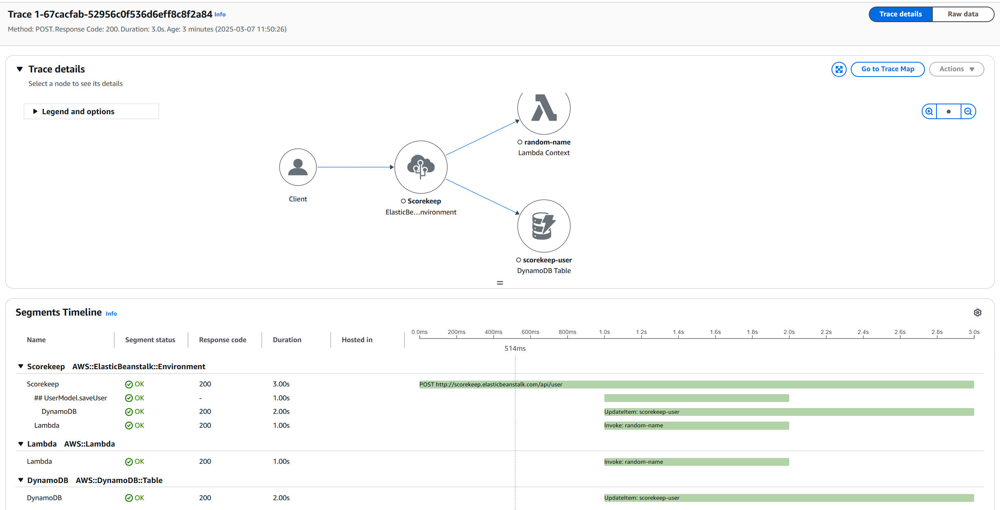
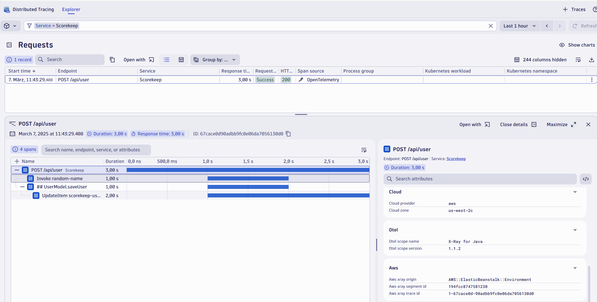
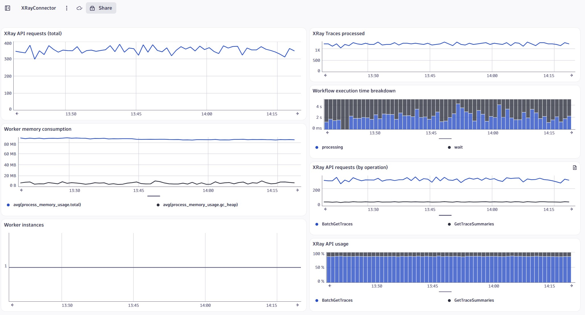
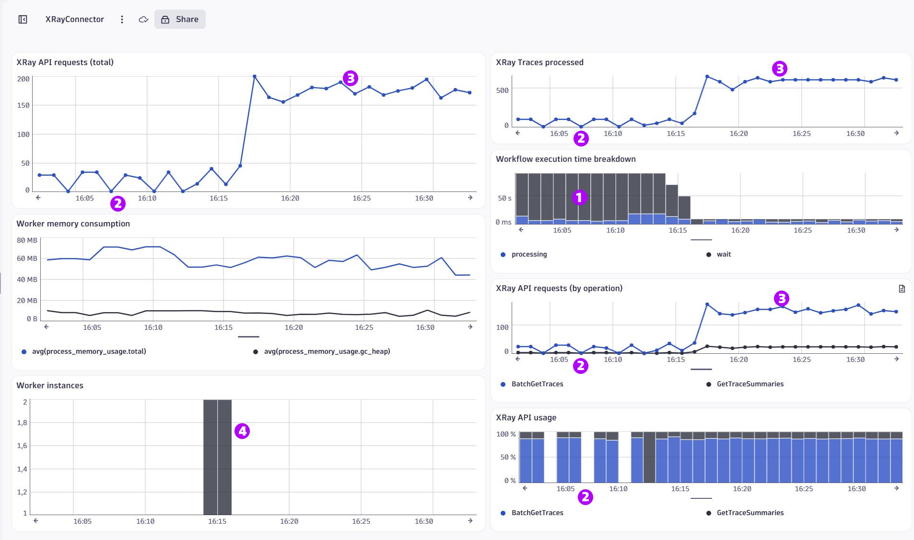

# AWS X-Ray Exporter for OpenTelemetry

This project allows reading trace telemetry (segment documents) pulled from the AWS X-Ray REST API and converting/forwarding it to an OpenTelemetry OTLP-compatible endpoint. 

It enables an observability solution to analyze the trace telemetry directly captured via e.g. OpenTelemetry together with X-Ray instrumented AWS services. Especially for fully managed (serverless) services such as Amazon API Gateway, which ONLY [support tracing using X-Ray](https://docs.aws.amazon.com/apigateway/latest/developerguide/apigateway-enabling-xray.html), the integration of X-Ray gives much better insights and end-to-end visibility. 

### Original Trace in X-Ray


### Trace exported into [Dynatrace](http://www.dynatrace.com)


### Trace correlation 
As AWS X-Ray uses its proprietary trace context, a transaction which passes multiple tracing systems such as X-Ray and OpenTelemetry (using W3C-TraceContext), will generate separated traces. To follow such a transaction you need to correlate the traces by capturing the trace context from the incoming different tracing system. This concept is also called *span linking*. 

### Logs in context of traces
AWS services with X-Ray enabled include X-Ray trace IDs in their log events. You can either look up the logs by the origin AWS X-Ray trace context, which is included as span attributes (```aws.xray.trace.id``` and ```aws.xray.segment.id```) or you can transform the X-Ray trace context in log events into the W3C trace context as used by the the conversion in XRay22OTLP. 

Whereas the span-id is derived from the segment-id without any further modification, the trace-id is converted using the logic ```SUBSTR(REPLACE_STRING(traceId, "-", ""), 1))```

An example of such a a log processing rule using Dynatrace is
```
PARSE(content, "JSON{STRING:traceId}(flat=true)")
| PARSE(content, "JSON{STRING:segmentId}(flat=true)")
| FIELDS_ADD(dt.trace_id:SUBSTR(REPLACE_STRING(traceId, "-", ""), 1))
| FIELDS_REMOVE(traceId)
| FIELDS_RENAME(dt.span_id: segmentId)
```
for structured logs or  
```
PARSE(content, "DATA 'XRAY TraceId:' SPACE? STRING:TraceId DATA 'SegmentId:' SPACE? STRING:SegmentId")
| FIELDS_ADD(TraceId,SegmentId)
| FIELDS_ADD(dt.trace_id:SUBSTR(REPLACE_STRING(TraceId, "-", ""), 1))
| FIELDS_REMOVE(TraceId)
| FIELDS_RENAME(dt.span_id: SegmentId)
```
for unstructured logs. 

## How does it work?

XRayConnector implements the workflow for polling from the [AWS X-Ray REST API](https://docs.aws.amazon.com/xray/latest/devguide/xray-api-gettingdata.html), does the data transformation and forwarding to an OpenTelemetry OTLP compatible endpoint. The data-transformation semantics converting from AWS X-Ray segment documents to OTLP is implemented in the XRay2OTLP library. 

XRayConnector provides a [REST API](#rest-api) to manage the workflow.

The **supported OpenTelemetry protocol** is [OTLP/HTTP JSON format](https://opentelemetry.io/docs/reference/specification/protocol/otlp/#otlphttp)

### Scalability & Portability
The workflow is implemented using [Durable Functions](https://learn.microsoft.com/en-us/azure/azure-functions/durable/durable-functions-overview?tabs=in-process%2Cv3-model%2Cv1-model&pivots=csharp), which abstracts away the complexity to manage a fault-tolerant and reliable polling mechanism as behind the scenes the framework manages state, checkpoints, and automatic restarts.  

Durable Functions are powered by the [Durable Task Framework (DTFx)](https://github.com/Azure/durabletask), which supports an extensible set of backend persistence stores. For this project the DurableTask.SqlServer extension is used to provide a cross-platform deployment using Kubernetes.

For more details about the architecture, scaling and operations using the SQLServer extension on K8s [read here](https://microsoft.github.io/durabletask-mssql/)

#### AWS X-Ray API-Limits
The AWS X-Ray REST API is subject to throttling when the rate limit of 5 requests per second is reached. This limits the total number of traces able to pull. The required number of requests for a number of traces can be estimated with the following formula:

````(NumberOfTraces * (1 + 20*RoundUp(AvgNumberofServicesPerTrace/10)))/100````

This number can be helpful to understand the request limits when optimizing the polling interval to balance telemetry latency and maxing out the number of traces / requests beeing able to export from X-Ray. For more details see section [Monitoring](#monitoring).

## Getting Started

### Pre-Requisites
For reading from the AWS X-Ray REST API, [create an AWS access key](https://docs.aws.amazon.com/powershell/latest/userguide/pstools-appendix-sign-up.html) with a policy that includes at least following actions ```xray:BatchGetTraces``` and ```xray:GetTraceSummaries```.

### Deploy to K8s 

#### Default configuration 
The default configuration uses a **polling interval** of **5 minutes** to retrieve recent traces. 

The XRayConnector pod is configured to use up to 5 workers, which should be sufficient to run the workflow in most scenarios, but it is recommended to test under load conditions. You should consider scaling out workers if your database tables ```dt.NevEvents``` or ```dt.NewTasks```start queuing up unprocessed events. 

The database is deployed using a stateful-set with 8 Gib storage. As DTFx is based on the event-sourcing pattern, the database can grow very fast. An automatic purge of the history is implemented as a cronjob in **xrayconnector.yml**. The cronjob calls the  [/api/PurgeHistory](#purge-workflow-history) **every 6 minutes** and keeps at least 30 minutes of historic events.

The xrayconnector.yml also includes a cronjob, that automatically calls [/api/WorkflowWatchdog](#check-status-of-the-workflow) to check the status of the workflow **every 3 minutes**.   

#### Step-by-Step Guide
**Step 1)** KEDA v2 is a pre-requisite. Make sure KEDA is up and running.  

For more details how to install KEDA, [see](https://keda.sh/docs/2.15/deploy/)

**Step 2)** Build the XRayConnector container and push it to your target repository
```
# Replace '<YOUR-REPOSITORY>' with your target container registry
docker build -t xrayconnector:latest -f ./xrayconnector/Dockerfile .
docker tag xrayconnector:latest <YOUR-REPOSITORY>/xrayconnector:latest
docker push <YOUR-REPOSITORY>/xrayconnector:latest
```

**Step 3)** Configure database 

Replace PLACEHOLDER in mssql-statefulset-secrets.yml to set the MSSql sa password ([MSSql password policy](https://learn.microsoft.com/en-us/sql/relational-databases/security/password-policy)) to setup database admin.

**Step 4)** Deploy mssql server and create the database
```
#!/usr/bin/env bash
set -euo pipefail

NAMESPACE="xrayconnector"

# 1) Create namespace (ignore error if it already exists)
kubectl create namespace "$NAMESPACE" || true

# 2) Apply secret and statefulset
kubectl apply -f mssql-statefulset-secrets.yml -n "$NAMESPACE"
kubectl apply -f mssql-statefulset.yml -n "$NAMESPACE"

# 3) Wait for the pod to be ready.
echo "Waiting for MSSQL pod to become Ready..."
kubectl wait --for=condition=ready pod -l app=mssql -n "$NAMESPACE" --timeout=300s

# 4) Get the pod name (by label). Falls back to the first pod if label isn't present.
mssqlPod=$(kubectl get pods -n "$NAMESPACE" -l app=mssql -o jsonpath="{.items[0].metadata.name}")

echo "Using pod: $mssqlPod"

# 5) Read SA password securely
read -s -p "Enter SA password: " mssqlPwd
echo

# 6) Create the DurableDB database using sqlcmd inside the pod
kubectl exec -n "$NAMESPACE" "$mssqlPod" -- /opt/mssql-tools18/bin/sqlcmd -C -S . -U sa -P "$mssqlPwd" \
  -Q 'CREATE DATABASE [DurableDB] COLLATE Latin1_General_100_BIN2_UTF8'

echo "CREATE DATABASE command sent."
```

**Step 5)** Configure the polling & forwarding of X-Ray data 

Replace the placeholders in connector-config.yml with proper values providing AWS secrets, OTLP endpoints, ..


**Step 6)** Configure the function keys and registry in xrayconnector.yml

* (Recommended) Replace all function keys ( host.master, host.function.default, ..), which protect your functions with new ones, encoded in base64. 
    * Generate a new key with e.g. OpenSSL: ```openssl rand -base64 32```
    * Base64 encode the returned key: ```echo -n '<THE NEW KEY>' | base64```
* (Recommended) Replace the host.masterkey used in the xrayconnector-watchdog cronjob ```http://xrayconnector/api/WorkflowWatchdog?code=<REPLACE-WITH-THE-NEW-KEY>``` with the newly created key. 
* Replace &lt;YOUR-REPOSITORY&gt; with the container registry, hosting your image

**Step 7)** Deploy config and XRayConnector
```
NAMESPACE="xrayconnector"
kubectl apply -f .\connector-config.yml -n "$NAMESPACE"
kubectl apply -f .\xrayconnector.yml -n "$NAMESPACE"
```
Checking deployment status...
```
kubectl get pods -n "$NAMESPACE"
kubectl rollout status deployment xrayconnector -n "$NAMESPACE"
```

### REST API

See ```test.http``` which provides api requests to be run in Visual Studio Code (VSCode) via the [REST Client extension](https://marketplace.visualstudio.com/items?itemName=humao.rest-client).

#### Manually start the workflow
If autostart is disabled, you need to automatically trigger the main workflow timer.

```POST https://xxxx/api/TriggerPeriodicAPIPoller?code=<YOUR-FUNCTION-HOST-MASTER-KEY>```

#### Terminate the workflow
Manually stop the workflow. Does not disable autostart! 

```POST https://xxxx/api/TerminatePeriodicAPIPoller?code=<YOUR-FUNCTION-HOST-MASTER-KEY>```

#### Check status of the workflow
Checks the status of the workflow. If autostart is enabled, enforces a start of the workflow. 

```POST https://xxxx/api/WorkflowWatchdog?code=<YOUR-FUNCTION-HOST-MASTER-KEY>```

#### Purge workflow history
Purges the workflow history for completed, failed or terminated instances. Optionally provide a timespan in minutes to only delete history older than X minutes. 

```
POST https://xxxx/api/PurgeHistory?code=<YOUR-FUNCTION-HOST-MASTER-KEY>
content-type: text/plain

360
```

#### Test API 
A simple endpoint to see if the api is up & running

```GET https://xxxx/api/TestPing?code=<YOUR-FUNCTION-HOST-MASTER-KEY>```

#### Ingest a sample trace into X-Ray for testing 
Sends a sample trace into X-Ray. This feature requires additional actions granted in your AWS IAM policy: ```xray:PutTelemetryRecords``` and ```xray:PutTraceSegments```

```POST https://xxxx/api/TestGenerateSampleTrace?code=<YOUR-FUNCTION-HOST-MASTER-KEY>``` 

#### Send a sample trace to the backend 
Sends a sample trace to the configured OTLP endpoint to validate connection settings. 

```POST https://xxxx/api/TestSendSampleTrace?code=<YOUR-FUNCTION-HOST-MASTER-KEY>``` 

## Monitoring

XRayConnector provides several metrics to monitor its execution: 

| Metric name | Metric type | Unit | Additional dimensions | Description 
|---|---|---|---|---
|workflow.polling_interval|Gauge|Milliseconds|workflow_instance, label|Times spent during polling interval
|api_calls|Counter|Count|api, account, operation, paged, replay|Number of api requests
|api_response_objects|Counter|Count|api, account, objectname|Number of objects returned
|process_memory_usage.total|Gauge|Bytes||Process total memory
|process_memory_usage.gc_heap|Gauge|Bytes||Process managed memory


[Dynatrace Sample Dashboard Configuration](./XRayConnector-Dashboard.json)

### How metrics help optimizing configuration parameters
The following snapshot shows a test-run using the XRay Api simulator mode. It demonstrates an initially poor utilization of the X-Ray API in combination of an unnecessary high latency of data beeing exported and how it looks after configuration optimization is applied. 


In the first phase, a large polling interval is used and the majority of the time spent during a run is waiting, which can be seen in the "Workflow execution time breakdown" **(1)**, as well as the request numbers dropping to zero **(2)**.

After a configuration change, reducing the polling interval targeting only a minimal wait each interval, we see a constant utilization of the X-Ray api and processing of traces during the whole period **(3)**. *Note:  The rise in total api-calls and traces is caused as the simulator returns a fixed number of traces each call, independent of the polling interval.*

The sample also shows a seamless rolling update, having the new pod running in parallel showing a second instance **(4)**, before the first pod is terminated.  

## Contribute
This is an open source project, and we gladly accept new contributions and contributors.  

## License
Licensed under Apache 2.0 license. See [LICENSE](LICENSE) for details.
